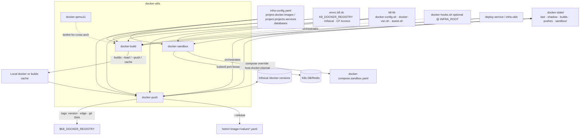

# Project Architecture

## Overview

**docker-utils** is the Docker image build / push / live-sandbox layer of the
Noizu k8s deployment toolchain. Four Bash 4+ CLIs in `bin/` read image and
project targets from the merged monorepo `infra-config.yaml` `project:` section,
build with BuildKit/buildx (multi-arch by default when
`K8_DOCKER_MULTIARCH=true`), push to `$K8_DOCKER_REGISTRY` with
Infisical-resolved patch versions, and optionally run app sandboxes against
kubectl-forwarded prod DB/services.

| Concern | Tool |
|---------|------|
| Build configured targets (flat or composite) | `docker-build` |
| Infisical version resolve + retag + push (+ Helm tag bump) | `docker-push` |
| Compose sandbox + port-forwards to prod DB/Redis | `docker-sandbox` |
| Privileged QEMU 11.x binfmt for amd64-on-arm64 | `docker-qemu11` |

Install: `make install` → `~/.local/bin` (+ bash/zsh completions under
`$XDG_DATA_HOME`); also via monorepo root `make install-utilities`. Dual path:
`Portfolio/Utilities/source/docker-utils` ↔ `utilities/k8/docker-utils`.

Runtime shared logic lives in **k8-lib** (`~/.local/share/k8-lib`):
`docker-config.sh` (targets, state, Infisical preflight), `docker-vsn.sh`
(version resolve), `assist.sh`, `bash-runtime.sh` (Bash 4+ gate).

## System Diagram

## Core Components

| Component | Purpose |
|-----------|---------|
| `bin/docker-build` (~1069 loc) | Resolve targets (name, CWD auto-detect, globs, `--all`/`--pick`/`--include`); BuildKit/buildx with local cache under `.tmp/buildx-cache/`; platforms via `--native` / `--multiarch` / `--platform` or per-image config; Elixir cross-arch diagnostics; frontend `NPM_TOKEN` secret; multi-target zellij panes (reuse current session when `$ZELLIJ` set) or background jobs + `.tmp/docker-build-logs/`; optional `--push` / `--release` / `--publish-chart` passthrough to push |
| `bin/docker-push` (~1080+ loc) | Next patch from Infisical (`/docker-versions`); prod `v{M}.{m}.{PATCH}` vs non-prod `v{M}.{m}.{P}-{env}.{SUB}`; retag + push (or `--remote` via `buildx imagetools`); digest skip when edge already matches local; `--release` awk-bumps Helm `image.tag`; `--headless` ⇒ `--yes --no-zellij --remote`; multi-target zellij or sequential |
| `bin/docker-sandbox` (~566 loc) | Resolve domain from arg or CWD; start DB (+ optional Redis) port-forwards from `databases:`; write temp compose override (DB/PGHOST → `host.docker.internal`); run app `docker-compose.sandbox.yaml` (`up`/`down`/`logs`/`shell`/`build`/`ps`); PID state under `.docker-state/sandbox/` |
| `bin/docker-qemu11` (~71 loc) | Privileged `debian:unstable-slim` install of `qemu-user-binfmt` 11.x; register `qemu-x86_64`; `--check` inspects registration; rerun after Docker Desktop/OrbStack restarts |
| `completions/` | bash-completion + zsh `_docker-build` / `_docker-push` (installed by `make install-completions`) |
| `Makefile` | `install` copies four CLIs; `install-completions`; `compile`/`test` no-ops |

## Runtime Bootstrap (build / push / sandbox)

1. Gate Bash 4+ via k8-lib `bash-runtime.sh` (macOS `/bin/bash` 3.2 rejected).
2. Pre-parse `--config` / `--config=` → export `K8_CONFIG` **before** library source.
3. `source` `$K8_LIB_DIR/bin/docker-config.sh` (+ `assist.sh` on build/push; `_k8_check_assist`).
4. Optional `INFRA_ROOT/docker-hooks.sh` (build only) for per-repo hooks such as
   `_build_args_for_image`.
5. Targets and paths resolved from merged config helpers (`get_repo_dir`,
   `_registry_path_for_image`, `normalize_repo_name`, …).

## docker-build flow

**Target selection:** explicit name → `--include` (comma list + globs like
`codefre.sh/*`) → `--all` / `--pick` → CWD `detect_docker_repo`.

**Per image (`_build_single`):** resolve context/Dockerfile/registry_path/build
args/platform; tag `latest`, git SHA, timestamp-SHA, and edge placeholder
`v{M}.{m}.edge[-env]`; choose output mode:

| Mode | When | Effect |
|------|------|--------|
| `push` | `--push` | `buildx --push` multi/single-arch to registry |
| `load` | single-arch / `--native` | `buildx --load` into local docker |
| `cache` | multi-arch without push | cache only (no multi `--load` on classic docker store) |
| `legacy` | `--no-buildx` | plain `docker build` |

Records state via `save_build_state`. On `--push`, re-invokes `docker-push
--remote` so Infisical can attach the monotonic version tag (multi-arch already
published under the edge/placeholder tag). Upfront push confirm avoids a
double buildx export when the user wants push without having passed `--push`.

**Multi-target:** zellij panes when available (add to current tab if already
inside zellij; else new session + KDL layout); `DOCKER_BUILD_PANE_SHELL` or
parent-shell detection; panes `exec` into user shell after build. Fallback:
parallel background jobs + logs under `.tmp/docker-build-logs/`, then sequential
push if requested.

## docker-push flow

1. Resolve target: name → CWD → recent `.docker-state/last` (<5m prompts) →
   unpushed `builds` toggle list.
2. `_infisical_preflight` (shared; build runs this early when `--push`).
3. `resolve_vsn` (k8-lib `docker-vsn.sh`) → Infisical keys for major/minor track.
4. **Prod:** fetch/increment patch counter → `v{M}.{m}.{N}`; seed `0` on first
   track; CHANGELOG confirm (headless auto-confirms with log line).
5. **Non-prod:** patch read-only unless `-up`; increment env sub-version →
   `v{M}.{m}.{P}-{env}.{S}`.
6. Tags pushed: version, `v{M}.{m}.edge[-env]`, optional git SHA. Skip
   increment if remote edge config digest matches local image.
7. Local path: `docker tag` + push; remote path: `buildx imagetools create`
   from placeholder manifest.
8. `--release`: update `helm/<image>/values.yaml` (prod) or
   `values-<env>.yaml` `image.tag` via awk.
9. `record_push_state`; offer remaining unpushed builds.

## docker-sandbox flow

Domain from arg (`therobotplans.com` or `domain/service`) or composite project
path under CWD. Requires `docker-compose.sandbox.yaml` under project
`base_path` or `base_path/app`. Maps DB via `databases:` (auto or `--db`);
optional Redis when `redis_service` set. Override sets `DB_HOST` /
`DATABASE_HOST` / `PGHOST` (+ ports) and Redis env on `sandbox`, `backend`,
`migrations` services. Foreground `up` traps cleanup of port-forwards; detached
keeps PIDs in `.docker-state/sandbox/`.

## Configuration

| Source | Role |
|--------|------|
| `project.docker.images[]` | Flat targets (`name`, `context`, `dockerfile`, `registry_path`, `build_args`, `platform`) |
| `project.type: composite` + `projects[].services[]` | Targets as `<domain>/<service>`; `base_path` + relative context |
| Legacy `docker.repos` / `docker.mappings` | Loaded only when no `project:` docker targets found |
| `databases:` | Sandbox port-forward endpoints |
| Env / `.envrc.k8.dc` | `K8_DOCKER_REGISTRY`, `K8_DOCKER_MULTIARCH`, Infisical + CF Access for API |
| Optional `docker-hooks.sh` | Repo-local build customization |

`--include` matches **configured names**, not filesystem paths.

## Key Design Decisions

- **Config-driven targets, not paths** — reproducible from any CWD; agents need
  names/globs only.
- **k8-lib not vendored** — shared target discovery, state files, Infisical
  preflight, and versioning with sibling k8 utilities.
- **Infisical as monotonic version authority** — concurrent builders/CI share
  counters without committing version bumps.
- **Build/push split via `.docker-state/`** — push (and `--release`) can lag
  build or run in another invocation; multi-arch handoff uses `--remote`.
- **zellij with agent-safe fallback** — panes when interactive; `--no-zellij` /
  `--headless` for scripts/CI.
- **QEMU registration separate** — privileged and ephemeral across VM restarts;
  not folded into every build.
- **Sandbox as compose + forward overlay** — live app code against real DB
  without baking cluster networking into images.

## Dependencies

| Dependency | Used by |
|------------|---------|
| Docker + BuildKit, `docker buildx` | build, push (remote tags) |
| `yq` v4+ | config parsing (via k8-lib / sandbox) |
| k8-lib (`~/.local/share/k8-lib`) | all except qemu11 |
| Infisical API + operator/CF creds | push versioning |
| `aws` ECR CLI (optional) | remote tag existence / digest compare |
| `zellij` (optional) | multi-target parallel UI |
| `kubectl` | sandbox port-forwards |
| Docker Compose v2 | sandbox |
| Bash 4+ | build, push, sandbox |

## Ecosystem Fit

One layer below **`deploy-service`** (infra-utils): that tool composes
build → push → Helm values bump → `helm-upgrade`. Standalone
`docker-push --release` covers the values-bump step only. Helm charts live in
the upstream `noizu-infra` repo (`kubernetes/helm/`); monorepo
`.infra-config.yaml` `helm:` stanzas on images map chart paths for the broader
deploy pipeline. Complements **helm-utils**, **secret-utils**, and **cluster-utils**
in the same utilities install set.
