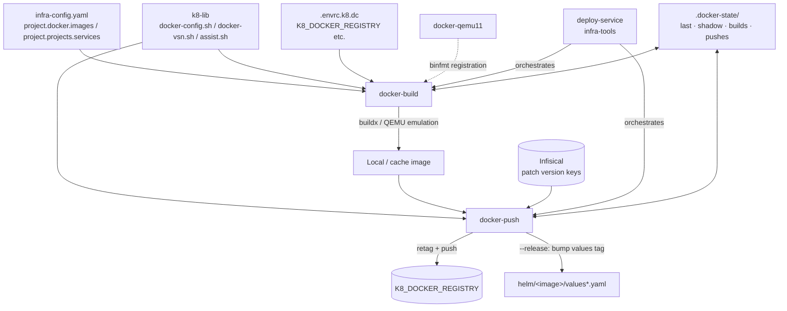

# Project Architecture

## Overview

`docker-utils` is a terminal utility package providing the Docker image
build/push layer of the Noizu k8s deployment toolchain. Three bash executables
in `bin/` (`docker-build`, `docker-push`, `docker-qemu11`) read image targets
declared in the merged `infra-config.yaml` `project:` section, build them with
BuildKit/buildx (multi-arch by default when `K8_DOCKER_MULTIARCH=true`), and
push them to `$K8_DOCKER_REGISTRY` with Infisical-resolved patch versioning.

The scripts are installed to `~/.local/bin` via `make install` (or the repo-root
`make install-utilities`) and depend at runtime on the shared **k8-lib** shell
library (`~/.local/share/k8-lib`, sourced from `share/k8-lib/`) for config
resolution (`docker-config.sh`), version resolution (`docker-vsn.sh`), and the
`_k8_check_assist` agent-assist hook (`assist.sh`). They sit one layer below
`deploy-service` (in `infra-tools`), which composes build + push + Helm values
bump + `helm-upgrade` into the full deploy pipeline.

## System Diagram

## Core Components

| Component | Purpose |
|-----------|---------|
| `bin/docker-build` (~1057 loc) | Resolve targets from config (flat, composite `<domain>/<service>`, globs, `--pick`), build via buildx; parallel multi-build in zellij panes or background jobs; `--native`/`--multiarch`/`--platform`; optional `--push`/`--release` passthrough |
| `bin/docker-push` (~1088 loc) | Resolve next patch version via Infisical (prod: `v{MAJ}.{MIN}.{PATCH}`; non-prod: `-{env}.{SUB}` sub-versions), retag, push; `--release` bumps helm values tag; `--headless` for agents; zellij fan-out for `--all` |
| `bin/docker-qemu11` (~71 loc) | Register Debian-unstable QEMU 11.x binfmt (privileged) so amd64-on-arm64 Elixir/BEAM builds work when `tonistiigi/binfmt` lags; rerun after Docker VM restarts |
| `Makefile` | `make install` copies `bin/*` to `$INSTALL_DIR` (default `~/.local/bin`); `compile`/`test` are no-ops |
| `.docker-state/` (at project root, runtime) | Build/push handoff state: `last`, `shadow`, `builds` (unpushed queue, cap 10), `pushes` (history, cap 10) |

## Configuration Flow

Targets come from `infra-config.yaml`: `project.docker.images[]` for flat
images, or `project.type: composite` + `project.projects[].services[]` for
`<domain>/<service>` targets. `--config` is pre-parsed before k8-lib sourcing so
`K8_CONFIG` is honored by `docker-config.sh`. Legacy `docker.repos`/`docker.mappings`
load only when no `project:` targets are found. Registry and credentials come
from the environment (`.envrc.k8.dc` via direnv). An optional
`docker-hooks.sh` at `INFRA_ROOT` is sourced for per-repo customization.

## Key Decisions

- **Config-driven targets, not paths**: `--include` matches configured names/globs so builds are reproducible from any CWD and agents need no path knowledge.
- **k8-lib runtime dependency**: config/version/assist logic is shared with sibling `utilities/k8/*` packages rather than vendored — scripts assume `make install-utilities` has installed k8-lib.
- **Infisical as version authority**: patch numbers live in Infisical keys, letting concurrent builders and CI share monotonic versions without repo commits.
- **zellij with graceful fallback**: multi-target work fans out into zellij panes when available, otherwise background jobs with log files (`.tmp/docker-build-logs/`); `--no-zellij`/`--headless` keep it agent-safe.
- **Build/push split with state files**: `docker-build` records builds to `.docker-state/`; `docker-push` consumes them, so push (and Helm tag bump via `--release`) can happen later or from another invocation.
- **QEMU registration kept separate**: `docker-qemu11` needs `--privileged` and is transient across VM restarts, so it is not folded into `docker-build`.

## Ecosystem Fit

Part of the monorepo `utilities/` family installed together by the root
`make install-utilities`. `deploy-service` (infra-tools) drives the full
image → registry → Helm values → `helm-upgrade` pipeline; `docker-push
--update-helm`/`--release` covers the values-bump step standalone. Helm charts
themselves live in the upstream `noizu-infra` repo.
